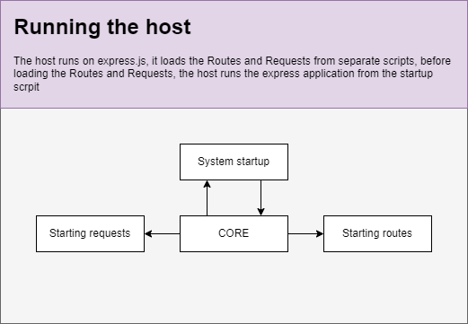
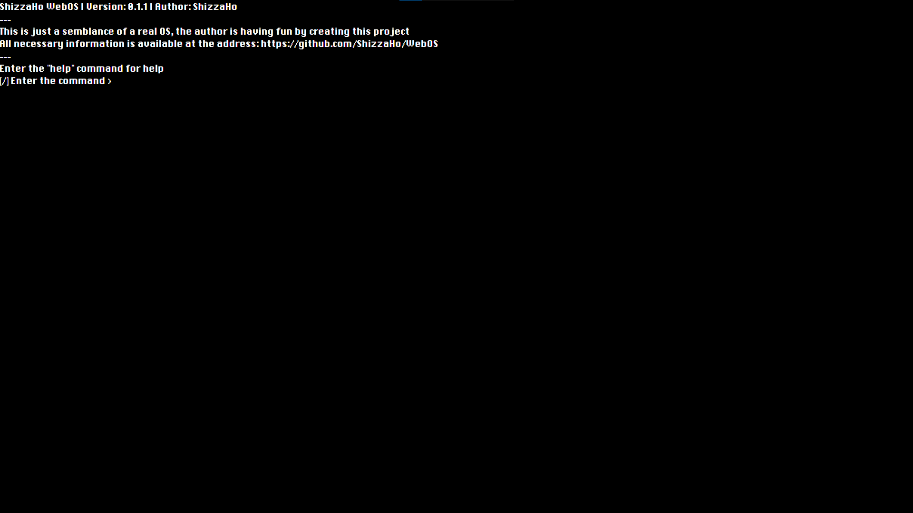
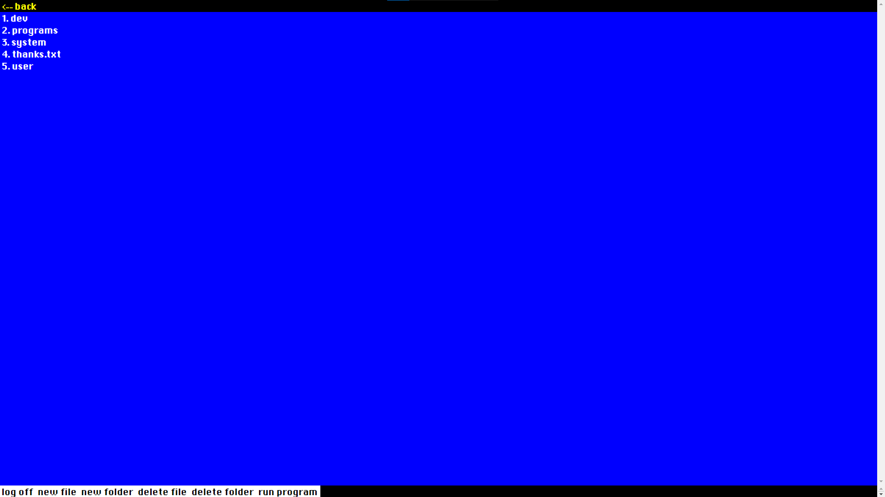

# ShizzaHo WebOS

**The system is just a parody of the real OS, it's just a toy for the developer :)**

## System startup

Make sure you have NodeJS installed on your PC before starting the system

Also remember to install dependencies: ``npm install``

Start the system in normal mode: ``npm start``

Start the system in developer mode: ``npm run dev``

After startup you can go to the system, it opens at [http://localhost:3000](http://localhost:3000)

## System operation

All the low level stuff is in the **core** folder, the exception is the **public** folder, where the high level is.

The low level is responsible for working with the present system (files, information etc.), with the host (express.js) and so on...

The script located in **public/scripts/core/index.js** is the bridge between low and high level, it communicates with the low level, it sends and receives requests from the low level, it stores the necessary system variables, methods necessary for the system (working with files, running programs, connecting libraries, etc.).

from this script also run the system modules, such as **hello** which acts as a "welcome" and "final setup" program (loading libraries, assigning system variables), and also starts the console, and **console** which provides a screen display of the system console.

## Operation of user programs

The program for **ShizzaHo WebOS** is located in an ordinary JS file, but in order for the program to start working, several conditions must be met:

* the program is always written in ES6+ Class, this is a system condition that must be respected.
* When the program starts, it must create an instance of its class.
* The name of the class is written in the following format: ``SystemStatus_Author_Name``, for example: ``System_ShizzaHo_Hello``, this is not mandatory, but recommended for characterizing programs.

Launching the system sets a new value for the variable **openProgramPath**, you can use this to connect other scripts or launch another program from a directory, the example program is in the standard system package, you can find the program by the path **memory/dev/simple_app/index.js**

Running user programs is done via a standard JavaScript method: **eval()**

## Libraries

The system supports connecting third-party libraries, for example, one of the standard libraries is **ShizzaHo_GUI**.

Libraries are scanned at system startup, and loaded into the system variable **libraries**.

Libraries are located in the path in: **memory/system/libraries**.

An example for creating a library can be found at the path: **memory/dev/simple_library/index.js**.

A library, as opposed to programs, works quite differently: a library in **ShizzaHo WebOS** terms is a set of methods which perform a certain task, these methods are wrapped in an object and returned via **return** method.

There are also two methods **start** and **stop**, they are necessary for developers who will use the library in their programs, the **start** method will act as a constructor that will perform the actions required of your library, the **stop** method is necessary to complete your library.

## Screenshots

## Other

[System commands](docs/en/system_command.md)